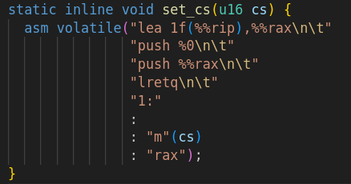
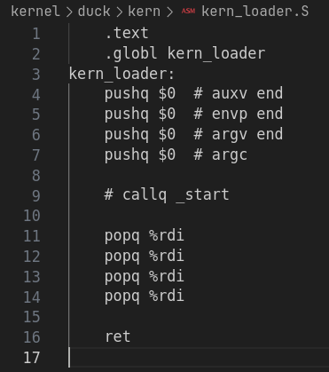

# JudgePenguin 第13周进展

## 监控程序

### 上周发现的崩溃问题

使用 QEMU 发现出现了 kernel panic，原因是 Kernel Page Fault，`CR2 = 0x00000028`，页面未映射

由下面这段内嵌汇编导致（注释后问题暂时消失）：

> 由于 Code Segment 无法直接修改，参考 jailhouse 进行了以下实现（主要依赖 `lretq` 指令工作）

暂时没有查清楚这段代码导致访问对 `0x00000028` 进行访问的原理？

可能需要研读 Intel 文档仔细理解一下 CS / GDT 的细节

### 迁移 JudgeDuck-OS

- 将 `JudgeDuck-OS` 的 `kern`、`lib`、`inc` 移植到项目中，删除了网络相关的部分

- 将 `duck-binaries` 中预编译的 `musl-libc`、`libstdc++` 导入项目

- 学习了 Makefile 的嵌套使用方式，成功编译得到 `kernel.bin`

但是…

- 一启动就爆炸💣

  现象是 QEMU 立刻重启；添加 `-no-reboot -no-shudown` 选项之后发现 QEMU 没有给出任何错误信息

  ~~通过枚举法~~定位到问题出现在 `callq _start` 与进入 `main` 之间，怀疑 `duck-binaries` 不能简单移植（计划周一与 wys 联系排查问题）

  

- 上周的崩溃问题现在不需要重入就能触发了（悲）

  导入 JudgeDuck 之后 `kernel.bin` 的大小达到了 200 KiB 级别，涉及多个 Page，可能与此有关？

## 下周计划

- 研究 gdb 接入 QEMU，进行更精细的调试（目前遇到了 accelerator 不支持 debugging 的奇怪问题？）
- 继续迁移 JudgeDuck-OS（解决 duck pre-built `musl-libc` 的内部问题？）
