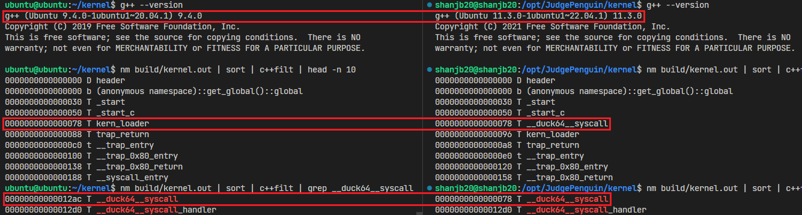
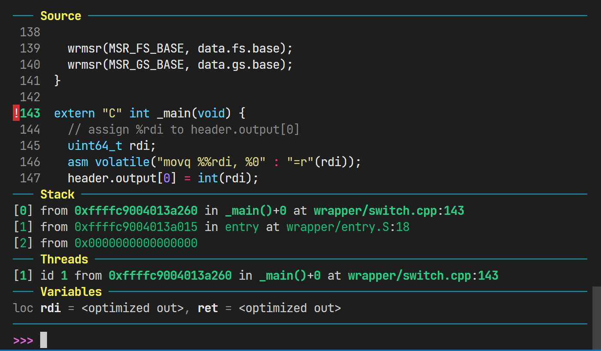
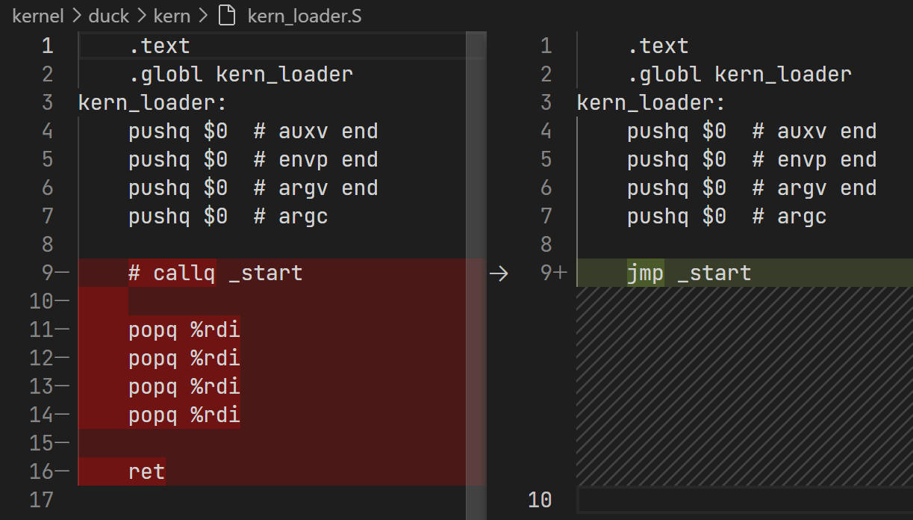
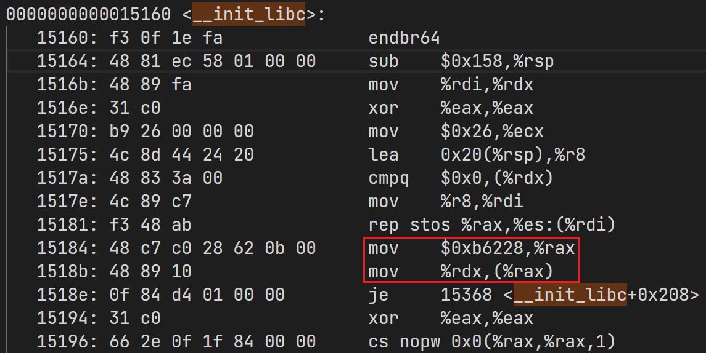
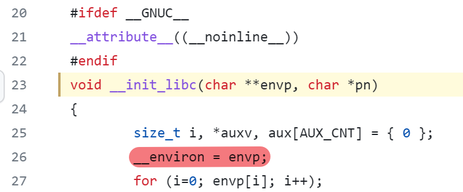
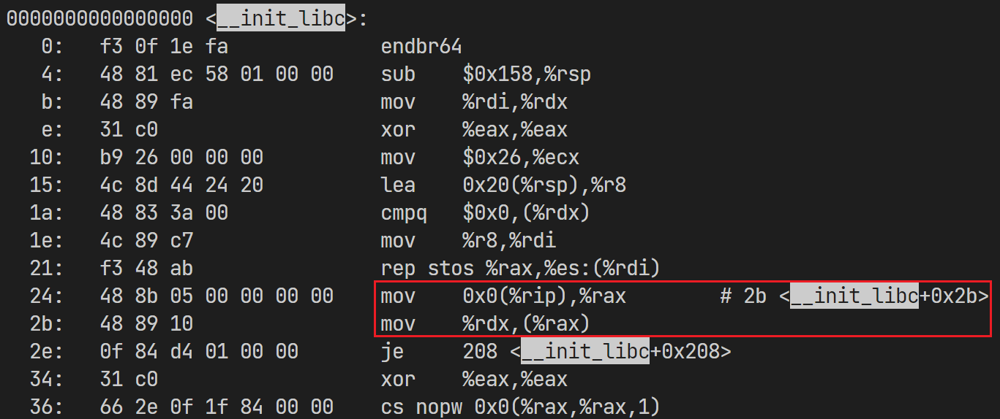
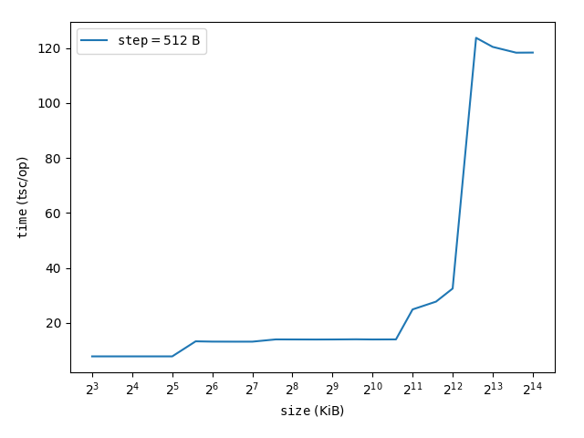

# JudgePenguin 第 14,15 周进展

## 使用 gdb 调试 JudgePenguin 内核

向 QEMU 添加选项 ` -gdb tcp::1234 -S` 打开 TCP 调试接口并在启动后等待 gdb 连接

在 gdb 中使用 `target remote localhost:1234` 即可连接到 QEMU

---

为了避免 ASLR 对 Linux 虚存地址进行随机偏移，在 grub cmdline 中添加 `noaslr nokaslr` 关闭 ASLR

这样以后内核模块能够获取到确定的虚存地址，直接从日志中找到 kernel 的 entry 地址，添加断点：

```gdb  
b *0xffffc90040139ffc
```

---

由于 `-gdb` 与 `-accel kvm` 不兼容，导致每次以 gdb 模式开机需要 > 5 min，在 gdb 模式下编译非常缓慢

> **失败尝试**	尝试在 WSL 与 QEMU 里以相同选项分别编译 kernel，发现产物并不相同！
>
> 

折衷方法是以 kvm 模式启动后 scp 传入代码，编译后将产物导出；随后再以 gdb 模式启动，进行调试

---

以上操作之后能调了，但只能看到 disassemble 出的指令，非常难调

希望 gdb 能够获取到 kernel 的符号表、源代码

首先让 gdb 直接从 ELF 文件中加载符号表，**需要手动设置偏移**

由于 ELF 被紧接着加载到 page table 后，偏移量即为 page table break，可以从 driver 的日志中获取

```gdb
symbol-file build/remote.out -o 0xffffc90040136000
```

接下来使用 `-d` 选项向 gdb 提供源代码目录

之后就可以在 gdb 中以符号名设置断点，显示源码：




## `0x00000028` Page Fault 问题

上周没想明白为什么会访问 `0x00000028`

单步调试后发现 kernel 中一些函数开头有 `mov %fs:0x28,%rax `，但 `fs` 段为空，于是执行后访问 `0x00000028`，发生 Page Fault 

检查手册发现 `%fs:0x28` 存放的是 Stack Canary，于是直接 `-fno-stack-protector` 把它关掉

## 修复一些 bug

重新运行，发现 musl libc 内部（`_start` 与 `main` 之间）发生访存异常

单步调试 & 阅读 [musl 源码](https://github.com/bminor/musl)意识到我对 `_start` 的使用方式理解不太不正确：



主程序 exit 后并不是通过 `_start` 返回，而是需要从收到 exit 的 `syscall_handler` 中直接跳回来

## PIC 问题

重新运行，发现进入 `_start` 后执行到了 `__init_libc` 然后又发生了 Page Fault

继续 kernel 反汇编结果发现了如下指令（in `kernel.asm`）：



源码：



链接前（in `libc.a`）：



ld 链接出了 P<sub>osition</sub> D<sub>ependent</sub> E<sub>xecutable</sub> 的 ELF！

> JudgeDuck 编译产物也是 none-PIC 的，但 duck 能够保证将 ELF 加载到先验确定的**虚存**；这在 JudgePenguin (Linux) 中是难以（先验地）确定的

---

尝试修复：给 g++ 添加 `-pie -fPIC -fPIE`，给 ld 添加 `-pie -shared`，然后炸了：

```plain
ld: build/duck/kern/trap_entry.o: relocation R_X86_64_32S against symbol `__espfix_new_kernel_rsp' can not be used when making a PIE object; recompile with -fPIE
```

修改 `pushq __espfix_new_kernel_rsp` → `pushq __espfix_new_kernel_rsp(%rip)`，仍然爆炸：

```plain
+ ld build/kernel.elf
ld: build/duck/kern/trap_entry.o: relocation R_X86_64_32S against `.text' can not be used when making a PIE object; recompile with -fPIE
ld: failed to set dynamic section sizes: bad value
```

目前尝试了各种手段修复未果，正在考虑重写 `trap_entry.S` 


## 副产物：体系结构实验

在真机的内核模块里搞缓存测量，结果比普通环境稳定到不知哪里去了！



- `Intel(R) Celeron(R) N5105 @ 2.00GHz`，`x86_64` 架构，$4$ 核
- L<sub>1d</sub> Cache $128\ \mathrm{KiB}$，L<sub>1i</sub> Cache $128\ \mathrm{KiB}$，L<sub>2</sub> Cache $1.5\ \mathrm{MiB}$，L<sub>3</sub> Cache $4\ \mathrm{MiB}$
