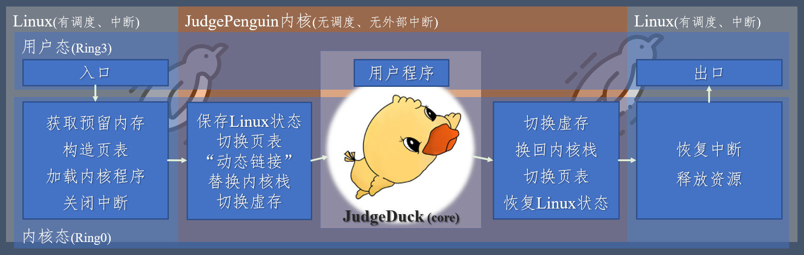
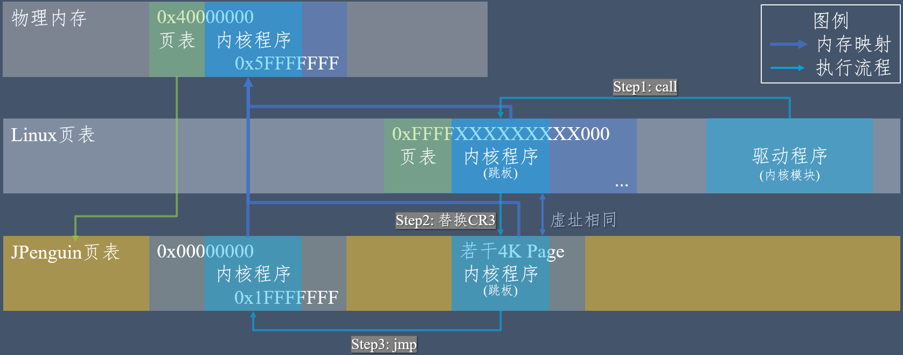
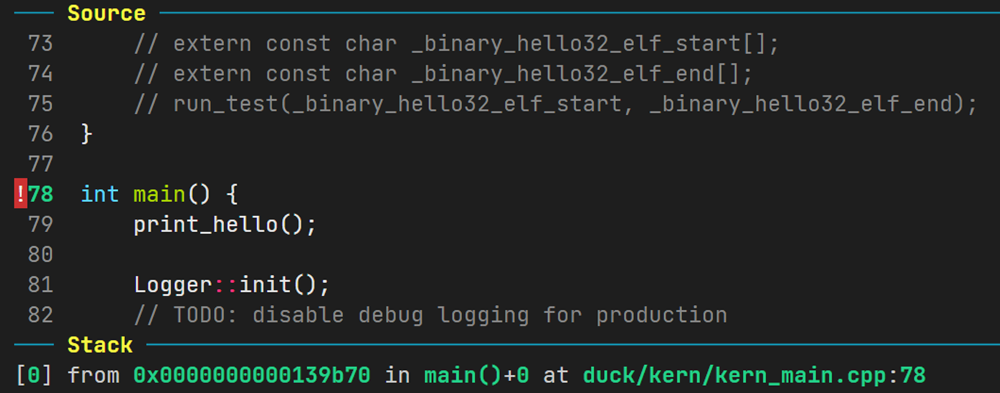
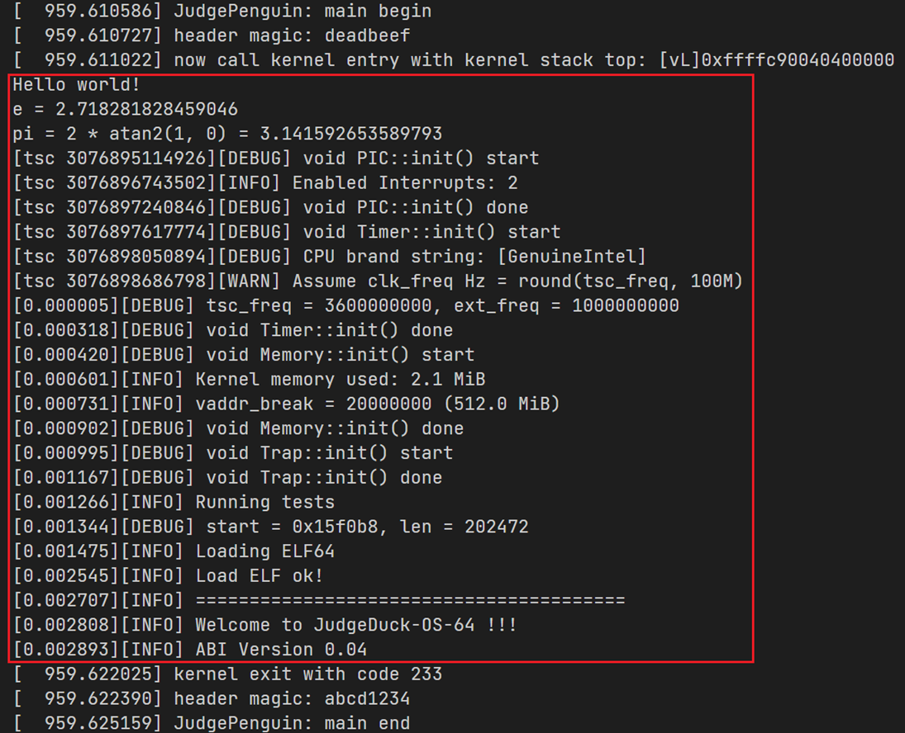
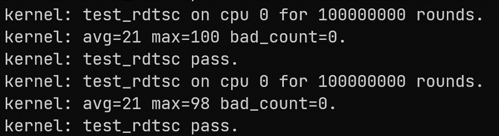
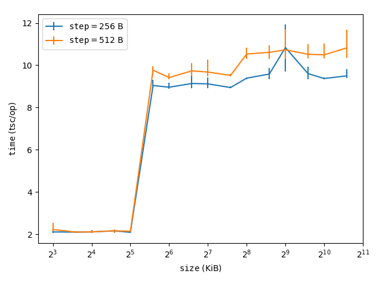
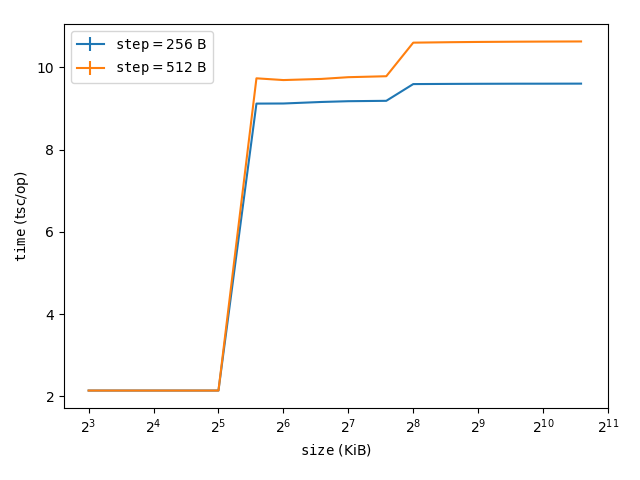

# JudgePenguin：基于Linux的应用程序稳态测试系统<br>阶段报告

<p style="text-align:center;">致理-信计01  单敬博  2200012711</p>

## 选题背景

在编程竞赛中，选手（用户）需要编写能够在规定**时间、空间限制**内解决给定问题的程序

- 用户程序通常被限制为单进程用户态程序
- 时间限制：user time；内存限制：最大驻留集

**测试系统**的任务：对用户程序进行**稳定、准确、安全**的测试

- 为用户程序提供**输入**，收集**输出**
- 尽可能**准确**测量用户程序的**时间**、**空间**使用情况
- 防止用户程序进行创建线程、连接网络、破坏系统等**非法或恶意的行为**

### 现有测试系统及其问题

在系统中直接运行的测试系统，如：Lemon, Cena, Arbiter, …

- 无法有效防范用户程序的攻击，例如直接在上下数级目录中查找答案文件

基于 docker / sandbox 的测试系统， 如：LOJ, TUOJ, UOJ, …

- 受虚拟化技术影响，时间测量结果波动较大（TUOJ 的误差可能高达100%！）

OS 中断与调度的影响：

- 用户程序执行过程中 OS 仍会收到来自外设、网络、时钟等的中断
- 用户程序也可能因为 OS 调度而暂停执行
- 处理中断、任务切换不增加 user time，但会对 cache 及 TLB 造成影响

内存分配不连续的影响：

- 常见 OS 的内存分配结果难以预测，用户程序访存时 cache 命中率不同

与其他进程共享资源的影响：

- 多核 OS 中其他进程会随机地对内存、L<sub>3</sub> cache、TLB 等共享资源产生难以预料的影响

  即使能够进行 cache 隔离，多进程同时访存造成的总线阻塞也会带来难以忽略且难以预测的性能波动

**自研操作系统**：[JudgeDuck-OS](https://github.com/JudgeDuck/JudgeDuck-OS)

- 屏蔽全部外部中断；为用户程序分配连续而确定的内存；用户程序独占全部系统资源
- **硬件驱动**需要自行编写，依赖特定硬件（网络部分依赖e1000网卡）

## 项目设计

稳定无干扰的环境只需在运行被测用户程序时提供；加载用户程序与数据、处理测试结果可以在任意环境中进行

借助 **Linux 内核模块**机制：

- 进行测试时阻塞 Linux，在专用内核中实现稳定、准确测试
- 测试完成后恢复到 Linux，在 Linux 中完成后续处理

项目整体分为**驱动程序**与**内核程序**两部分：

- 驱动程序：Linux 内核模块，主要负责分配预留内存，构造新页表、加载内核程序、屏蔽 Linux 中断及其逆过程；提供 Linux 用户态可用的接口，用于向内核程序提交测试任务
- 内核程序：保存 Linux 状态，切换到新页表，在稳定环境中启动 JudgeDuck 核心部分完成测试任务，随后恢复 Linux 状态并报告测试结果



<p style="text-align:center;"><strong>图 1</strong>：项目整体架构图</p>

## 已经实现的功能

- 通过 Linux 内核模块关闭中断，实现单核独占运行
- 在 Linux 中预留物理内存，在内核模块中获取并使用
- 构造 x86-64 $4$ 级页表，实现页表与内核栈切换，修复内存基址 $\implies$ 实现在地址确定的稳定环境中运行包含 libc 的内核态程序（即内核程序）
- 内核程序运行结束后能够顺利返回 Linux，Linux 运作正常
- 完成了 JudgeDuck-OS 核心部分约一半的迁移工作（暂时还不能正确测试用户态程序）
- 通过 `gdb` 远程调试在 QEMU Linux 中运行的程序，正确加载符号表、显示源码

### 关闭中断 <small>消除外设、 OS 调度的影响</small>

- `local_irq_save`：保存状态并关闭中断，其中间接执行了 `preempt_disable` 关闭抢占调度
- `on_each_cpu`：逐个核心执行
- `local_irq_restore`：恢复状态并打开中断

### 单核独占运行 <small>避免多核间资源共享带来的影响 </small>

在 `on_each_cpu` 中使用 `atomic_t` 使所有核执行到相同位置

接下来主核 (`cpu==0`) 独自执行后续任务，其他核 `cpu_relax` 忙等

```c
local_irq_save(flag);

atomic_inc(&call_done);
while (atomic_read(&call_done) != cpus) cpu_relax();

if (cpu) {
    while (atomic_read(&call_done) != 0) cpu_relax();
} else {
    ret = jpenguin_main(data);
    atomic_set(&call_done, 0);
}

local_irq_restore(flag);
```

### 获取预留物理内存

修改 `/etc/default/grub`，在 `GRUB_CMDLINE_LINUX` 中添加 `memmap=0x20000000\\\$0x40000000`（注意 `$` 经过两次转义），将一段物理内存标记为 Reserved，指示 Linux 不要使用这段内存

在内核模块中使用 `request_mem_region` 声明对这段物理内存的占用

```c
mem_res = request_mem_region(MEM_START, MEM_SIZE, "JudgePenguin MEM");
```

随后使用 `get_vm_area` 获取一段足够大的 Linux 虚存空间，使用 `ioremap_page_range` 在 Linux 页表中建立映射，之后就可以通过这段虚存访问预留的物理内存

> `ioremap_page_range` 已经是 Linux 内核弃用的符号，在 $<5.7.0$ 之前仍可以通过 `kallsyms_lookup_name` 搜索符号表获得指针并调用；但从 $5.7.0$ 起 `kallsyms_lookup_name` 也被移除，需要寻找其他内核函数进行替代

### 加载内核程序

向 Linux 注册一个设备 `/dev/JudgePenguin`，将内核程序 binary 作为该设备的固件安装到 `/lib/firmware` 中

在内核模块中使用 `MODULE_FIRMWARE` 声明固件；使用 `request_firmware` 加载内核程序，再 `memcpy` 到预留内存中去

> 注册设备之后，还可以使用 `ioctl` 与内核模块进行通信（暂未完全实现）

### 保存 Linux 状态

目前已知需要保存并恢复的寄存器 / 状态包括：

- `gdtr`，`idtr`，`tss`
- `cs`，`ds`，`es`，`fs`，`gs`，`MSR_FS_BASE`，`MSR_GS_BASE`
- `cr0`，`cr3`，`cr4`
- `MSR_EFER`，`MSR_LSTAR`，`MSR_CSTAR`，`MSR_STAR`，`MSR_SFMASK`

需要特别注意保证 `cr3` 的保存位置在切换页表后仍能访问

### 新页表的创建与切换

在预留内存的头部建立新的 x86-64 $4$ 级页表（称作 JudgePenguin 页表，JP 页表），将预留内存映射到 JP 页表中从 $\texttt{0x0}$ 开始的一段虚存；同时对内核程序所在的页添加与 Linux 页表中相同的映射，作为页表切换时的跳板

切换页表（即进入内核程序时），首先从驱动程序中通过 `call` 指令跳转到内核程序中，接下来通过替换 `CR3` 切换到 JP 页表，最后通过 `jmp` 指令跳到虚存低地址开始执行内核程序主体部分



<p style="text-align:center;"><strong>图 2</strong>：JudgePenguin页表的映射关系与切换流程</p>

### 替换内核栈 <small>内核程序的所有访存都与 Linux 无关</small>

JP 地址空间中存在高段、低段两个内核栈，它们实际上被映射到相同的物理内存

高端的地址位于 Linux 分配的虚存片段中，取值不确定；低段的地址仅由 JudgePenguin 决定，更加稳定

从 Linux 内核栈分两步切换到位于 JP 地址空间低段的内核栈

- 驱动程序将 JP 高地址栈顶指针作为参数传递给内核程序，进入内核程序后立即从 Linux 内核栈切换到 JP 高地址内核栈
- 切换页表后 JP 低地址生效，将 `rsp` 减去地址偏移，切换到低地址内核栈，随后再 `jmp` 到低地址中的 `duck::kern_loader`

### “动态链接” <small>链接musl-libc，运行时修复基址偏移</small>

尝试直接链接内核程序时生成了一些位置相关内容，人工修改汇编源代码、链接时添加 `-pie` 选项后解决了大部分问题

JudgeDuck 使用了 musl-libc，其中一些指针无法被 `-pie` 正确处理，仍会生成位置相关代码

驱动程序加载的是内核程序的 binary 而非 ELF，因此难以实现真正的动态链接，于是改为由驱动程序传入基址偏移，内核程序在进入 duck 前手动修复需要动态链接的变量

### `gdb` 调试 QEMU

 内核程序独立于 Linux 运行，在调好串口之前无法打印日志，只能使用 `gdb` 连接 QEMU 进行调试

开启 ASLR 将会对 Linux 虚存地址进行随机偏移，需要在 `GRUB_CMDLINE_LINUX` 中添加 `noaslr nokaslr` 关闭 ASLR

使用 `symbol-file` 指令加载内核程序符号表，需要使用 `-o` 设置手动计算得到的偏移（注意 JP 高低地址切换时需要以新的偏移重新加载符号表）；使用 `-d` 选项提供源码目录

这样以后就可以 `b entry` 打断点，进入内核程序触发断点，开始调试



<p style="text-align:center;"><strong>图 3</strong>：使用 <code>gdb</code> 调试 JudgeDuck 的 <code>main</code> 函数</p>

### 启动 JudgeDuck

已经完成迁移的部分：`printf`，`<cmath>`，`PIC::init()`，`Time::init()`，`Trap::init()`，`load_elf64()`

暂时遇到问题的部分：`LAPIC::init()`（出现了 `assertion failed`）

正在迁移中的部分：`Memory::init()`（涉及大量页表标志位的设置工作）



<p style="text-align:center;"><strong>图 4</strong>：JudgeDuck 向串口的输出</p>

### 从 JudgeDuck 退出

向 `__duck64__syscall_handler` 添加了 `SYS_exit` 的处理，直接跳转到 `duck_exit`

`duck_entry` 被 `<caller>` 调用时高地址返回地址被压栈，其在跳转到低地址的 `duck::kern_loader` 前，先将 JP 高地址 `rsp` 保存下来；跳转回 `duck_exit` 时先将 `rsp` 恢复为高地址，`ret` 时将直接返回高地址中的 `<caller>`

```assembly
    .text
    .globl duck_entry
duck_entry:
    // ... pushq callee saved registers
    movq %rsp, .wrapper_rsp(%rip)
    // switch kernel stack pointer to JPenguin low virtual address space 
    addq %rdi, %rsp
    // calculate the address of the duck kernel loader in JPenguin low virtual address space
    leaq kern_loader(%rip), %r15
    addq %rdi, %r15
    jmp *%r15
    
    .globl duck_exit
duck_exit:
    movq .wrapper_rsp(%rip), %rsp
    // ... popq callee saved registers
    movq %rdi, %rax
    ret
```

## 稳态测试

在成功运行用户态程序之前，我编写了下面两个测例来验证本项目确实能够提供稳态运行环境

### `rdtsc` 测试

使用 `rdtsc` 指令连续多次读取 CPU 时间戳，记录间隔最大值

若没有中断影响，最大值应稳定取得较小的值 （例如 $\leq 100$）

- 普通环境中测试：$t>10^4$ 在 $10^8$ 次中出现超过 $10^3$ 次

- 稳态环境中测试：总有 $t_\max \leq 100$



<p style="text-align:center;"><strong>图 5</strong>：稳态环境中 <code>rdtsc</code> 测试结果</p>

### cache 测试 <small>体系结构课缓存测量作业的正确打开方式</small>

以 $\mathrm{step}$ 为步长，循环访问大小为 $\mathrm{size}$ 的内存 $N$ 次，记录 tsc 间隔 $T$，则单次访存耗时为 $T/N - \varepsilon$，在每级 cache 大小附近将出现跳变

- 在普通环境中测试：高级别缓存被多任务共享，$\mathrm{size}$ 较大时测量结果波动很大，甚至掩盖跳变现象
- 在稳态环境中测试：所有资源独占使用，结果非常稳定

<table>
    <tbody align="center">
        <tr>
	        <td></td>
            <td></td>
        </tr>
        <tr>
	        <td><strong>图 6.1</strong>：普通环境中 cache 测试结果</td>
            <td><strong>图 6.2</strong>：稳态环境中 cache 测试结果</td>
        </tr>
    </tbody>
</table>

## 工作量

**项目代码量**：工作主要集中在 `driver/` 与 `kernel/wrapper/` 两个目录下，其中 `.{c,cpp,h,hpp,S}` 的总行数分别为 $718$、$446$；同时也在 `kernel/duck` 中进行了一些兼容性修复工作；整个项目中的源代码行数为 $7,958$

由于 Linux 内核模块开发的困难性以及 jailhouse、JudgeDuck 中缺少文档说明魔法操作数量过多，我开发的精力主要花费在试错与修复上，很多情况下编码-调试时间占比超过 $1:5$；仅 Github 有记录的 addition 行数就为项目行数的两倍，本地调试过程中编写的代码更是难以统计


<p style="text-align:center;"><strong>图 7</strong>：Github 变更仓库统计</p>

## 未来工作

- 完成 JudgeDuck-OS 的剩余迁移工作

  主要困难在于 <u>Linux 状态保存</u>与 <u>PIC 改造</u>

- 设计、完善用户接口，使项目更加简单易用（基于`ioctl`）

- 提升项目对不同版本 Linux 内核的兼容性（目前需要 $<5.7.0$）

- 在更多真机上部署项目（更多数量&更多型号）

- $\implies$ <u>计划明年在**真实比赛**中使用本项目提供评测服务</u>

## 附录：相关工作

### [JudgeDuck-OS](https://github.com/JudgeDuck/JudgeDuck-OS)

自研的应用程序稳态测试操作系统

依赖硬件的问题已在前文讨论

目前已经将其核心部分整体导入到本项目中

### [RTAI](https://www.rtai.org/)

Real Time Application Interface：Linux 内核硬实时扩展，主要解决有较强实时性要求的任务调度与进程通信问题

保证了任务执行的实时性，基本解决了任务切换问题；但外部中断、内存分配、资源共享等问题仍未解决

### [Xenomai](https://source.denx.de/Xenomai/xenomai/-/wikis/home)

Xenomai 有两种~~写法~~形式

- Mercury 形式：一份数千行的 Linux 内核补丁

  从 `irq_save / irq_restore` 开始 patch 了几乎所有与中断异常相关的内核函数，非常不优美

- Cobalt 形式：向 Linux 添加另一个实时内核构成双内核架构

  我们希望尽可能屏蔽所有干扰项，双内核与此背道而驰

### [RVM1.5](https://github.com/rcore-os/RVM1.5) / [JailHouse](https://github.com/siemens/jailhouse)

RVM1.5：Rust 编写的 Type-1.5 Hypervisor，先从宿主 OS 启动 Hypervisor，再启动其他 OS，支持 OS 间通信

Jailhouse 也使用了内核模块技术，它验证了技术路线可行，同时提供了一些实现上的参考

主要问题：引入Hypervisor，带来额外开销；提供了过多与本项目目标无关的功能，不如自己实现一份精简的


